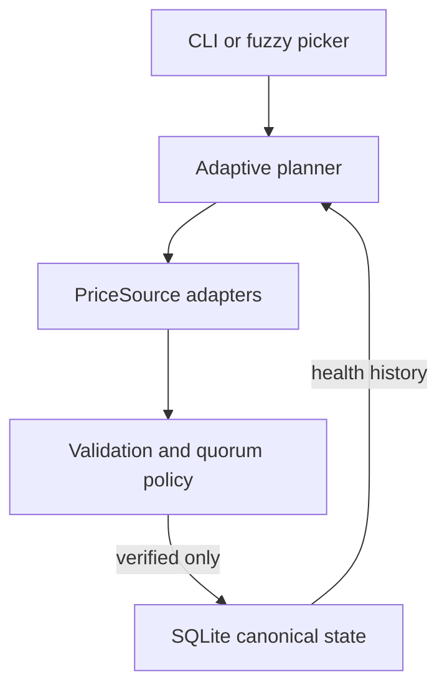

# FeedVerdict

An explainable multi-source cryptocurrency price reconciliation agent.

FeedVerdict fetches real public market data from Coinbase, Kraken, and Bitstamp,
checks the providers' own timestamps, and persists a canonical price only when
independent evidence forms quorum. It detects successful-but-stale payloads,
bounded-request timeouts, malformed responses, unsupported markets, and material
cross-source disagreement without crashing or silently guessing.

The current suite contains 29 offline tests and a 6/6 deterministic
decision-contract evaluation.

## Quick start

Requires Python 3.11+.

```bash
python -m venv .venv
source .venv/bin/activate
python -m pip install -e .

# Real exchange data for an explicit market
feedverdict BTC USD

# Telescope/fzf-style discovery and fuzzy selection
feedverdict
```

In picker mode, type `bitcoin`, `ethereum`, `BTC`, `ETH`, or any discovered
exchange symbol, then press Enter. Only markets covered by at least two
independent sources appear; a one-source market cannot form quorum.

For an entirely offline proof of the failure behavior:

```bash
feedverdict demo stale
feedverdict eval
```

## Architecture



Every built-in or config-driven adapter produces the same `PriceObservation`:
source, normalized market, price, provider event time, HTTP receipt time, event
ID, and latency. The policy never contains provider-specific JSON knowledge.

## Adaptive workflow

| Current evidence | Next action |
|---|---|
| No evidence yet | Fetch the highest-ranked primary source |
| Primary failed or its observation is stale/invalid | Fetch an alternative |
| Exactly one fresh price | Fetch an independent verifier |
| Two fresh prices agree within the spread limit | Stop and persist quorum |
| Two fresh prices materially disagree | Fetch a third tie-breaker |
| Two of three form the largest consistent cluster | Exclude the minority outlier and reduce confidence |
| Sources exhausted without quorum | Return candidate/no-quorum and preserve prior canonical state |

The third source is not called on the healthy path. The trace therefore proves
the workflow is conditional, not a fixed “always call all APIs” sequence.

## Trust policy

Defaults are configurable with `--max-age` and `--max-spread-bps`.

- Price must be positive and finite.
- Market must match the requested normalized `BASE/QUOTE` pair.
- Provider timestamp must be timezone-aware, no more than 5 seconds in the
  future, and no more than 120 seconds old.
- HTTP receipt time is recorded but never substituted for provider time; doing
  so would make a cached stale payload look fresh.
- A canonical price requires at least two distinct sources within 100 basis
  points (1%). Two readings from one provider are not two votes.
- The canonical value is the exact decimal median of the largest agreeing
  cluster.

| Result | Meaning | Canonical write |
|---|---|---|
| `VERIFIED/HIGH` | Clean independent quorum | Yes |
| `VERIFIED/MEDIUM` | Quorum after a fallback, rejection, or outlier | Yes |
| `UNVERIFIED_SINGLE_SOURCE/LOW` | One fresh candidate only | No |
| `NO_QUORUM/NONE` | No valid evidence or unresolved disagreement | No |

When a run cannot establish quorum, the previously verified SQLite record is
retained unchanged and printed separately.

## Real data sources

No API keys are needed for the built-in public endpoints.

| Source | Discovery | Price observation and freshness signal |
|---|---|---|
| Coinbase Exchange | Public products | Product ticker `price`, `time`, and `trade_id` |
| Kraken | Public asset pairs | Most recent public trade price, event timestamp, and trade ID |
| Bitstamp | Public markets | Market ticker `last` and provider `timestamp` |

Adapter fixture tests mirror the documented provider schemas. Live mode is an
operational smoke test and needs internet access; tests and evaluations never
depend on provider uptime. Provider documentation:
[Coinbase](https://docs.cdp.coinbase.com/exchange/reference/exchangerestapi_getproductticker),
[Kraken](https://docs.kraken.com/api/docs/rest-api/get-recent-trades), and
[Bitstamp](https://www.bitstamp.net/api/).

## Commands

```bash
# Direct real-data reconciliation
feedverdict BTC USD
feedverdict ETH USD --max-age 90 --max-spread-bps 75

# Interactive discovery
feedverdict
feedverdict --list-markets

# Persistent memory
feedverdict health
feedverdict canonical BTC USD

# Deterministic, clearly labelled fault injection
feedverdict demo healthy
feedverdict demo stale
feedverdict demo timeout
feedverdict demo outlier
feedverdict demo single-source
feedverdict demo all-failed

# Full decision-policy evaluation
feedverdict eval
```

Synthetic demos never write canonical state or source health. This prevents a
demo fault from changing subsequent live plans.

## Persistent canonical state and source health

SQLite stores:

- the latest verified canonical record for each market;
- every agent run and its structured decision trace;
- successes, failures, stale observations, price outliers, consecutive failures,
  and exponentially weighted latency for each source.

Unknown sources begin with a transparent Bayesian prior of `0.8`. Ranking uses:

```text
evidence = (successes + 4)
           / (successes + failures + stale + 0.5*outliers + 5)
score = evidence * 0.85^consecutive_failures
```

This is intentionally simple enough to explain and inspect with
`feedverdict health`. Unsupported market coverage is not counted as a provider
failure. Set `FEEDVERDICT_HOME` to relocate the default state directory at
`~/.local/share/feedverdict`.

## Add an HTTPS JSON API or CSV feed

```bash
feedverdict source validate examples/sources/http-json.example.json
feedverdict source add examples/sources/http-json.example.json
feedverdict source list
```

An API URL alone is insufficient: safely interpreting it also requires market
mappings, price path, provider timestamp path/format, and credential location.
Versioned configs provide those facts without changing the core. Credentials
may only be referenced through environment-variable names; plaintext URL or
static-query credentials are rejected.

Timestamped CSV exports use the same interface. See
[`docs/source-config.md`](docs/source-config.md) for both schemas and the boundary
where a small Python adapter is preferable to more config magic.

## Failure demonstrations and evaluation

`feedverdict eval` verifies six end-to-end contracts:

- clean two-source early stop;
- successful-but-stale primary with two-source fallback;
- watchdog timeout with two-source fallback;
- material disagreement requiring a third-source tie-breaker;
- one fresh source producing an unverified candidate but no write;
- complete failure producing no quorum and no guess.

It checks status, confidence, source count, canonical-write permission, and a
required machine-readable reason code. Details are in
[`docs/evaluation.md`](docs/evaluation.md).

## Verification

```bash
make verify
```

Equivalent commands:

```bash
PYTHONPATH=src python -m unittest discover -s tests -v
PYTHONPATH=src python -m feedverdict eval
python -m compileall -q src tests
```

GitHub Actions runs the package install, compilation, 29-test suite, and
decision evaluation on Python 3.11, 3.12, and 3.13.

## Docker

```bash
docker build -t feedverdict .

# Direct command with persistent SQLite state
docker run --rm \
  --volume feedverdict-data:/data \
  feedverdict BTC USD

# Interactive fuzzy picker
docker run --rm -it \
  --volume feedverdict-data:/data \
  feedverdict
```

The image runs as a non-root user and writes only to `/data`.

## Repository map

```text
src/feedverdict/agent.py            adaptive observe/assess/plan loop
src/feedverdict/reconciliation.py   deterministic validation and quorum policy
src/feedverdict/sources/            built-in provider adapters
src/feedverdict/custom_sources.py   validated JSON/CSV adapter engine
src/feedverdict/state.py            canonical records, traces, source health
src/feedverdict/scenarios.py        deterministic fault injection
src/feedverdict/evaluation.py       end-to-end decision contracts
tests/                              offline adapter, policy, agent, state tests
docs/demo-script.md                 timed walkthrough under three minutes
```


## Deliberate trade-offs

- Last trade is used as the comparable observation across all three providers.
  An executable trading system would reconcile bid/ask depth and fees instead.
- The default age/spread policy is global and conservative. Production policy
  should be market-specific and learned from historical volatility/liquidity.
- Custom HTTP configs use explicit static market mappings. Complex authenticated
  discovery, signing, or pagination belongs in a typed Python adapter.
- SQLite is appropriate for this single-process assessment. A multi-instance
  service would use a transactional shared store and idempotent run IDs.
- Source-health scoring is evidence-based but intentionally modest; it does not
  claim that historical reliability guarantees a future price is correct.

## What I would do next

1. Replay captured, redacted production traces and measure false accept/reject
   rates before tuning per-market freshness and spread thresholds.
2. Add circuit breakers, jittered backoff, and concurrent alternative fetches
   under a total workflow deadline.
3. Reconcile executable bid/ask depth, fees, quote conversions, and market
   liquidity rather than only last trades.
4. Export OpenTelemetry traces and Prometheus counters for source latency,
   staleness, disagreement, confidence, and canonical age.
5. Move canonical state to Postgres for multiple workers and add idempotency and
   migration tooling.
6. Add an HTTP service only when a concrete consumer needs one. An optional LLM
   could summarize an existing structured trace, but would never choose the
   canonical numeric value.

## Demo and submission

- [`docs/demo-script.md`](docs/demo-script.md) is timed for a 2:45 recording.
- [`docs/submission-checklist.md`](docs/submission-checklist.md) covers public-link
  and logged-out verification.

## License

MIT
